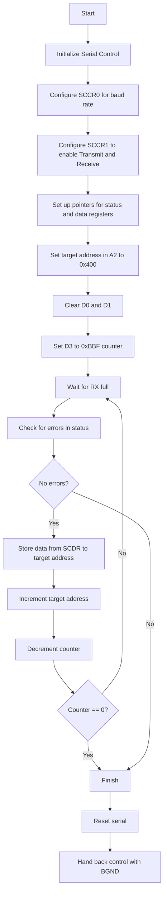

# mc68331-boot

Initial bootloader for MC68331 to receive the next stage from the internal serial peripheral.
It expects to be places at 0xFC0.
It expects 3007 bytes and writes them to 0x400 in RAM.
When finished it will return control to the debugger attached via BDM.

## Flowchart

